<!-- Create a public repo named exactly "abdulhadinp" and put this file in it as README.md -->

<!-- HERO SECTION -->
<picture>
  <source media="(prefers-color-scheme: dark)" srcset="assets/hero.svg">
  
</picture>

  

<!-- 01 / FROM THOUGHT TO THING -->
<picture>
  
</picture>

  

<!-- 02 / BUILDER CREDENTIALS -->
<picture>
  
</picture>

  

<!-- 03 / THE ENGINE ROOM -->
<picture>
  
</picture>

  

<!-- 04 / THINGS I BUILD -->
<picture>
  
</picture>

  

<!-- 05 / THE ROADMAP -->
<picture>
  
</picture>

  

<!-- 06 / LIVE FROM GITHUB -->

  
  

<!-- Rock-Solid 3D Snake / Contribution Visualization -->

  

  

<!-- 07 / WORK WITH ME -->
<picture>
  
</picture>

  

<!-- START A CONVERSATION -->
<picture>
  
</picture>

  <a href="https://linkedin.com/in/abdulhadinp">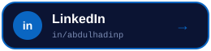</a>
  <a href="mailto:abdulhadi4172@gmail.com">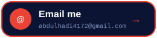</a>
  <a href="https://abdulhadi.com.np">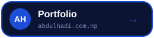</a>

  
  <a href="https://instagram.com/abdulhadinp">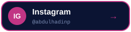</a>
  <a href="https://kaggle.com/abdulhadinp">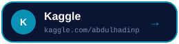</a>

 

<!-- FOOTER -->
<picture>
  
</picture>

<!-- 
Behind the scenes: 
This README isn't standard Markdown. It is driven by a custom procedural Python engine 
that computes particle physics, trigonometric orbits, and SVG animations natively. 
Curious how it's built? Check the `build.py` file in this repository. 
-->
